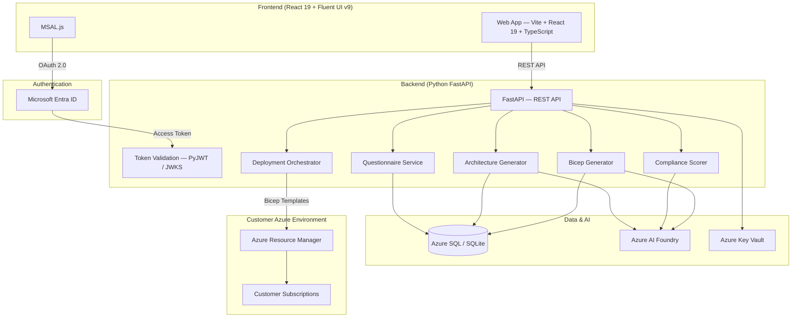

# OnRamp Architecture

## Overview

OnRamp is an AI-powered Azure Landing Zone Architect & Deployer. It guides customers through Cloud Adoption Framework (CAF) aligned landing zone design and deploys Bicep templates to Azure subscriptions.

## System Architecture



```
Frontend (React 19 + Fluent UI v9)
  ↓ REST API
Backend (Python FastAPI)
  ↓
Azure SQL + Azure AI Foundry + Azure Key Vault
  ↓
Customer Azure Subscriptions (Bicep deployments)
```

## Components

### Frontend
- **React 19** with TypeScript and Vite
- **Fluent UI v9** for Microsoft-standard UI components
- **MSAL.js** for Entra ID authentication
- Pages: Home, Wizard (questionnaire), Architecture (visualization), Deploy

### Backend
- **FastAPI** (Python 3.12+) with async support
- **SQLAlchemy 2.0** ORM with Azure SQL
- **PyJWT + JWKS** for Entra ID token validation
- Services: Questionnaire, AI Foundry, Archetypes, Bicep Generator, Compliance Scoring, Deployment Orchestrator

### AI Integration
- **Azure AI Foundry** for architecture generation, compliance evaluation, and Bicep code generation
- Prompt engineering framework with specialized system prompts
- Mock fallback for development without AI credentials

### Infrastructure
- **Azure Container Apps** for hosting (frontend + backend containers)
- **Azure SQL Database** for persistent storage
- **Azure Key Vault** for secrets management
- **Azure Monitor** + Application Insights for observability
- **Azure AI Foundry** for LLM model hosting

## CAF Design Areas

The application covers all 8 Cloud Adoption Framework design areas:

1. Azure Billing & Entra Tenant
2. Identity & Access Management
3. Resource Organization
4. Network Topology & Connectivity
5. Security
6. Management & Monitoring
7. Governance
8. Platform Automation & DevOps

## Landing Zone Archetypes

| Archetype | Org Size | Subscriptions | Management Groups |
|-----------|----------|---------------|-------------------|
| Small | 1-50 employees | 2-3 | Simplified hierarchy |
| Medium | 51-500 employees | 4-6 | Standard CAF hierarchy |
| Enterprise | 500+ employees | 8+ | Full enterprise-scale |

## Compliance Frameworks

SOC 2, HIPAA, PCI-DSS, FedRAMP, NIST 800-53, ISO 27001

## Security

- Entra ID authentication with MSAL
- Role-based access control (Admin, Architect, Viewer)
- Azure Key Vault for all secrets
- CORS restricted to allowed origins
- Input validation via Pydantic models
